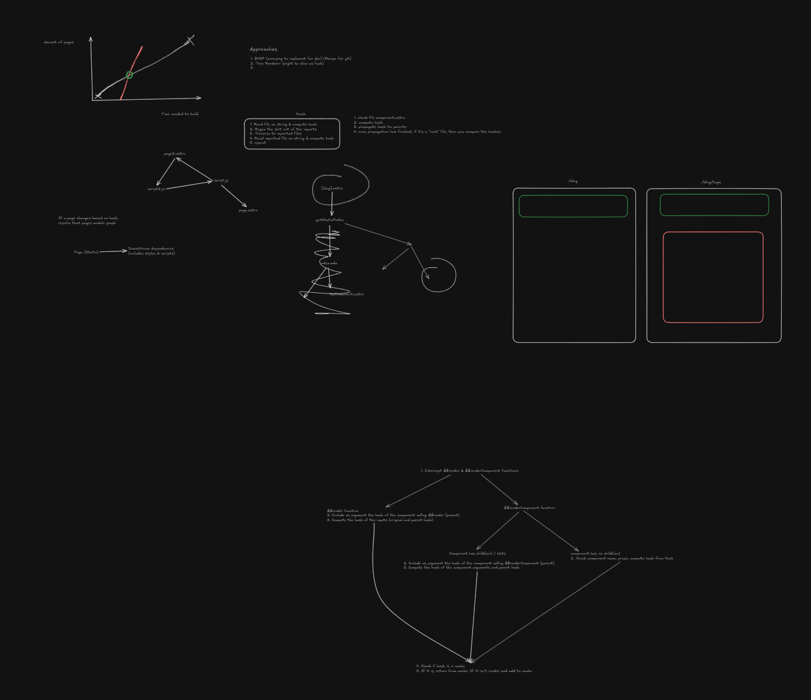

A long, long time ago, back when Astro didn't have incremental builds,
two mages met atop of a mountain to discuss their next mad idea.

"You ready to get started?", asked the first wizard. "Sorry, I need to
wait for a Netlify deployment to finish first. This documentation takes
ages to build.", replied the other. "It sure would be nice if there was a
way to speed that up. Incremental builds or something.", the first mage said.

It was at that moment that he realized: he knew a guy. The great mage,
spoken about in the myths and ancient legends, a master of the arcane knowledge.
They called the great mage and begun discussing. The ancient stone tablets reveal
some of the knowledge, although most of it looks like madness scribbled on an Excalidraw
board to those who cannot comprehend the arcane:

Legend has it that, at 12:30am, the mages begun conjuring their greatest spell so far.
Many had told them that whatever they were trying to do, they would fail, and that it
would be too difficult to conjure, the toll much too great. Nonetheless, the mages pushed
forward. After hours of blood, sweat and tears (of laughter™), their conjured masterpiece
laid before them. They decided to name it... Domain™ Expansion™.
